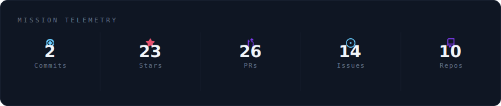

 

---

## About Me

**Software Development Engineer II** at **[Workday](https://www.workday.com)**, based in **Vancouver, BC, Canada**.

- Building production-grade automation for large-scale **Big Data infrastructure** — the systems behind distributed storage and compute at enterprise scale.
- Fleet-wide lifecycle engineering: OS/kernel rollouts, controlled maintenance, and end-to-end upgrade workflows.
- Hardening internal services and automation pipelines with config-driven, GitOps-style workflows.
- Improving observability through SLA/SLO-oriented metrics and infrastructure-as-code backed alerting.
- Goal: make massive infrastructure changes boring, measurable, and reversible.

---

## Tech Stack

**Big Data & Data Engineering**

**Languages**

**Platform & Infrastructure**

**CI/CD & Version Control**

**Observability & Monitoring**

---

## Currently

| What I build | What I explore |
|---|---|
| Hadoop infrastructure & platform reliability at enterprise scale | Distributed systems design patterns |
| Observability pipelines for Big Data workloads | Data lakehouse architectures |
| Internal tooling for Big Data platform teams | Stream processing & real-time pipelines |
| Scalable storage & compute on HDFS | Infrastructure-as-code for data platforms |

---

## LeetCode

---

## Galaxy Profile

  

  

  

  

---

> [!IMPORTANT]
> [My Resume](https://your-drive-link-here)

---

  

